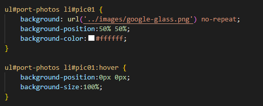

# Description
This project applies all the skills learned on week 1 of the bootcamp, the skills consists in HTML and how to structure the page using semantics elements, and CSS to style the page. 
The Portfolio was created by me, and the aim is to have a clean interface, not adding loads of colors, making it easy to read and navigate through the page. I also create as responsive as possible, in case the user has different monitor size or even try to open on the mobile phone. Another characteristic of the Portfolio, was to display some of the work I have done and also how to contact me.

* [Luiz Borges Portifolio](https://luizborges146.github.io/hw-portfolio/)

 

## Installation

N/A

## Usage

The website is a portfolio to display my skills in creating web page, so it contains links for my previously deployed web pages and also a section to contact me (Luiz Borges).
 
I also applied some style to make the page more dynamic and fun to use it:

* 

As some of the images, I decided to have a fix height or width, I create a media screen to resize some of the pictures in case the user try to check the information in a smaller screen size.
* 

## External support documentation

As part of the process, I used some references to complete the task:

* [Font Awesome](https://fontawesome.com/) 
* [W3School](https://www.w3schools.com/) 
* [Mozilla](https://developer.mozilla.org) 
* [READ.me](https://docs.readme.com/docs/linking-to-pages") 
* [GitHub](https://pages.github.com/) 
* [Git_cheat_sheet_pdf](https://education.github.com/git-cheat-sheet-education.pdf) 

## Social

  

N/A

## License

Please refer to the LICENSE in the repo.
